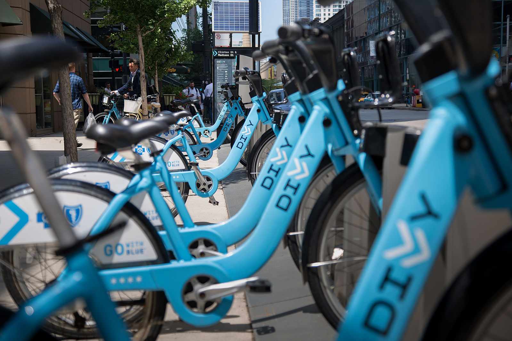

# Explore US Bike Share Data 
## By Mohamed Kamel
 _Udacity Data Analysis Nanodegree project_ 
 

## overview

Over the past decade, bicycle-sharing systems have been growing in number and popularity in cities across the world. Bicycle-sharing systems allow users to rent bicycles on a very short-term basis for a price. This allows people to borrow a bike from point A and return it at point B, though they can also return it to the same location if they'd like to just go for a ride. Regardless, each bike can serve several users per day.
In this project, I'll use the python and the panda to perform an analysis of bikeshare data from three large cities, Chicago, New York City, and Washington,to uncover bike share usage patterns. This project focuses on basic statistics  with panadas

## Dataset

<p>This dataset contains first six months of 2017  for all three cities. All three of the data files contain the same core six (6) columns:<p>

* Start Time (e.g., 2017-01-01 00:07:57)
* End Time (e.g., 2017-01-01 00:20:53)
* Trip Duration (in seconds - e.g., 776)
* Start Station (e.g., Broadway & Barry Ave)
* End Station (e.g., Sedgwick St & North Ave)
* User Type (Subscriber or Customer) 

The Chicago and New York City files also have the following two columns:
* Gender
* Birth Year

## Statistics Computed

#### 1. Popular times of travel (i.e., occurs most often in the start time)
    * most common month
    * most common day of week
    * most common hour of day
### 2. Popular stations and trip

    * most common start station
    * most common end station
    * most common trip from start to end (i.e., most frequent combination of start station and end station)
### 3. Trip duration

    * total travel time
    * average travel time
### 4. User info
    * counts of each user type
    * counts of each gender (only available for NYC and Chicago)
    * earliest, most recent, most common year of birth (only available for NYC and Chicago)


```python

```
